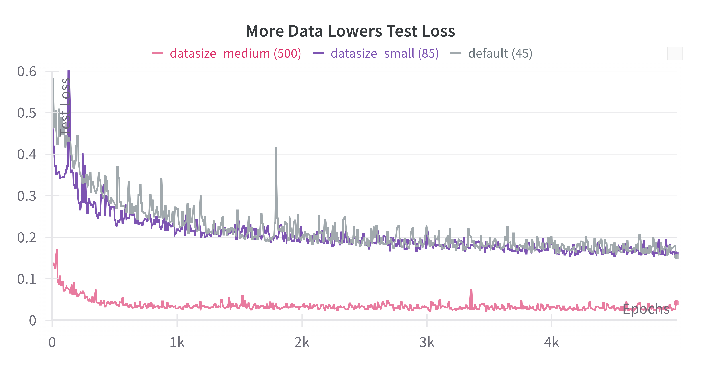
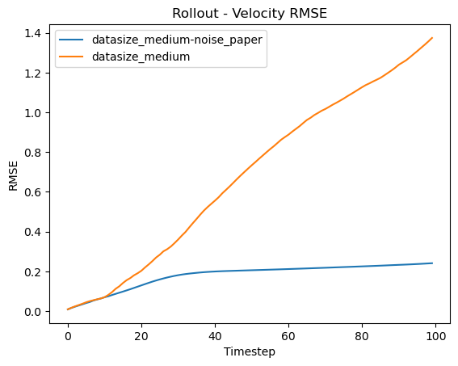

# Meshed-based fluid simulation with GNNs

### 1 - Qualitative results

First, we visualize a model trained on the medium dataset (500 timesteps). 
5k epochs take about 4h on an RTX 3060.
We animate the next-step-predictions for 500 timesteps of the same trajectory we trained on.

The model performs much worse during the first few timestesps (~2-10).
Since we train less than a single trajectory with randomly selected timesteps, the first few timesteps are rarely seen during training.

)

### 2 - Training on more data

We see a clear advantage when training on more data (going from 45 to 500 timesteps).
We are still far away from the original paper, which trained on $1,200 * 600 = 740,000$ timesteps!

Looking at the loss curve, it is probably much better to trade of fewer epochs in favor of more data.

### 3 - Including noise

Next let us see the effect of adding noise during training.
So far we have only looked at single-step predictions, in contrast to full rollouts.
During rollouts we feed the model predictions back in as inputs for the next timestep, which leads to accumulating errors.
The model is only trained to do single-step prediction: the current true velocity is the input, the next velocity is the target.
The idea is that adding noise during training imitates making predictions with imperfect inputs.

Indeed we see that adding noise during training can reduce the accumulation of error, at least for the timesteps 50-150.

### 4 - Generalize to new trajectories

We can also use the same model on an unseen trajectory, and it generalizes!

)

### Further experiments

There are many more experiments to run. 
Note that I only run a single random seed, so none of the results are statistically significant.
Also, there are plenty shortcuts and probably bugs in the code.

## Reproduce runs

I used the following runs to generate the data:
- default `python run_gnn.py`
- default-datasize_medium `python run_gnn.py +datasize=medium`
- default-datasize_medium-noise_paper `python run_gnn.py +noise=paper +datasize=small`

## Project outline

There existed a (prior PyTorch project by three Stanford students)[https://medium.com/stanford-cs224w/learning-mesh-based-flow-simulations-on-graph-networks-44983679cf2d]
which I build on. Thank you!
But the project
(a) did not include code to generate their data 
(b) did not add noise during training 
(c) only tested on single-step predictions instead of full rollouts
(d) could not train and test on different trajectories 
(e) was partially broken 
(f) lacked infrastructure to run experiments

I:
- Added code to convert the original data (.tfrecord) into a general format (.hdf5)
- Rebuild the Colab project code into a working codebase
- Added noise during training, as in the original paper
- Build evaluation to rollout trajectories
- Added bells and whistles to run experiments (train and test on different trajectories, wandb logging, hydra configs, resume checkpoints)

I also looked into predicting the sizing field for a couple of hours.
One would need to implement the sizing field prediction and the sizing-based remesher.
